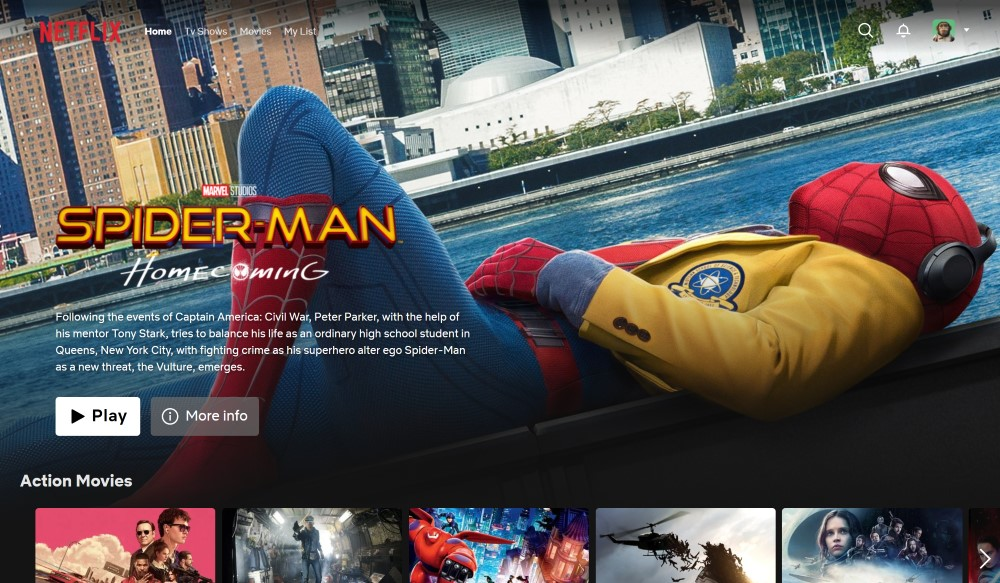
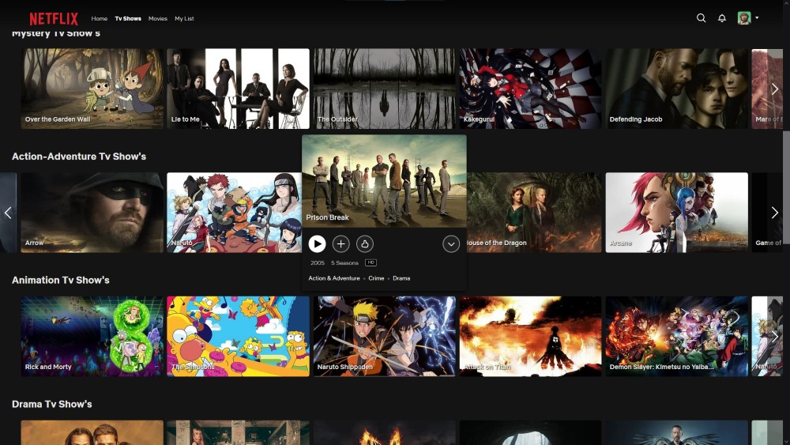
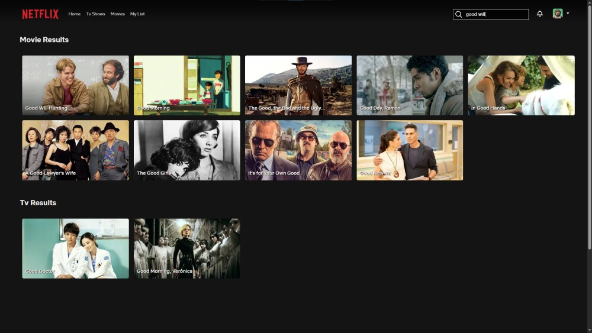
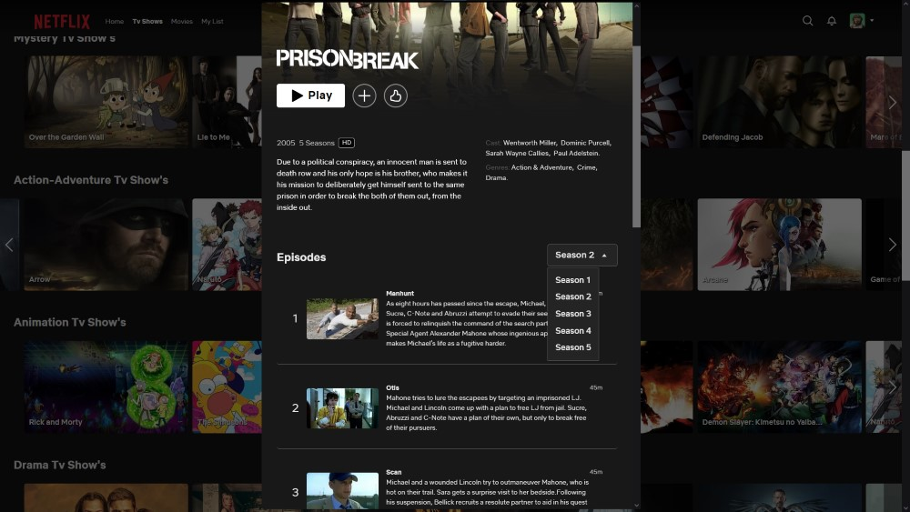
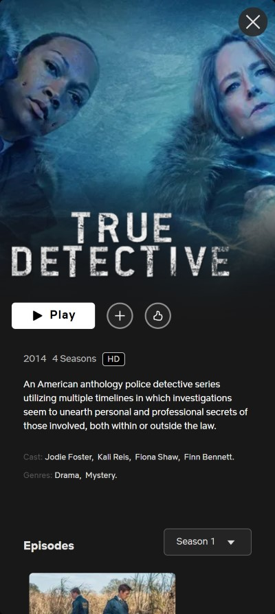
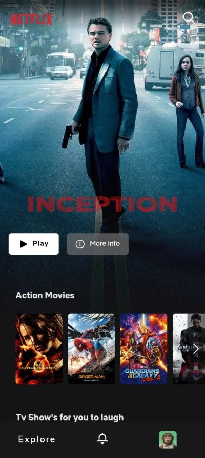

# 🎬 Netflix Clone — Angular 19 + TMDB API

A fully responsive Netflix-style web app built with **Angular 19**, connected to **The Movie Database (TMDB)**.

This project was generated using [Angular CLI](https://github.com/angular/angular-cli) version 19.0.6.

## 🔎 Live Demo
[View live project on netlify](https://netfflixx-clone.netlify.app/)

---

## Main Features

- Integrated with the **TMDB API** to fetch real, up-to-date movies and TV shows data
- **Infinite horizontal slider** to scroll through movies
- **Hover previews** on movie cards using **Angular CDK Overlay**
- **Search** to find titles (only in English)
- **Modal with movie or series details** including:
  - Overview, genres, cast
  - Seasons and episodes (for series)
- **Add or remove movies** from your personal list
- **Skeleton loaders** for better loading UX
-  Fully **responsive** — works on desktop, tablet, and mobile

---

## 📸 Screenshots
### Desktop

   
   
   
  

### Mobile

   
  

---

## 🛠️ Tech Stack

- **Angular 19** with standalone components
- **Angular CDK Overlay** — for modals and hover cards
- **CSS** — for layout and responsiveness
- **TMDB API** — for movie/series data
- **RxJS / Signals** — for reactive UI and state management

---

## What I Learned

- How to structure a real-world SPA using **Angular 19**
- Leveraged **Angular CDK Overlay** for creating advanced hover and modal components
- Built an **infinite scroll slider** that mimics Netflix’s UI
- Created a responsive layout using pure CSS without external libraries
- Worked with **real API data** from TMDB and displayed complex nested content
- Managed custom user state (like personal lists) using Angular's reactivity
- Improved UX using **skeleton loaders** during asynchronous data loads
- Designed smooth interaction flows between **hover**, **modal**, and **card**

---

## Disclaimer

This is an educational project. It is **not affiliated with Netflix or TMDB** in any way.

